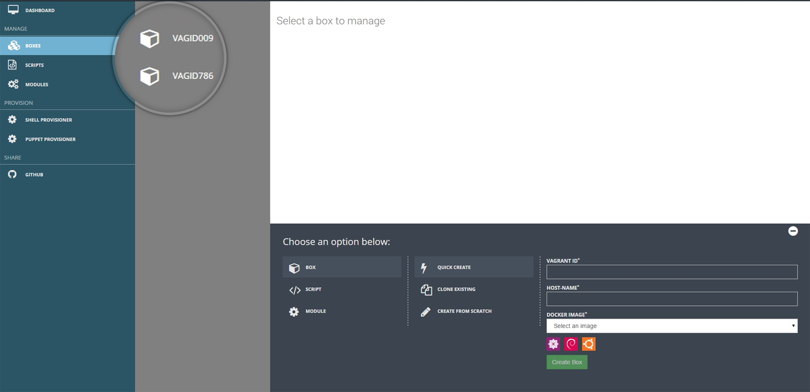

##Creation of Boxes/ Provider Chosen-Docker

**Scenario 1**– You chose **Docker** as the provider while creation of workspaces.

The tool provides users with 3 super easy methods to **Create Boxes**.
Lets go through each one of those. The first one on the list is

**QUICK CREATE –**

In this method you just need to specify the following attributes – 

1. Vagrant ID
2. Hostname 
3. Choose from one of the Docker Images provided in the drop down menu, the selection could also be made by clicking on the thumbnail logos as well. 
4. Hit Create

{: .img-responsive}

The boxes created will be visible as shown in **(Snapshot 4)**

{: .img-number}
{: .img-responsive} ``4``

Next  method on the list is- **Create from Scratch**

**Create From Scratch**

As you click on Create from Scratch a pop box will appear with 3 tabs – 

1. Box Settings 
2. Networking 
3. Folders

We will explore more on each of these tabs one at a time:

**Box Settings** – This screen is very similar to the one we have already stumbled across during the discussion of  Quick Create  method So if you need a quick revision on what to do on this screen  just jump back to the previous slide. **(Ref- Snapshot 5)**

{: .img-number}
{: .img-responsive} ``5``

**Networking** – On this tab you can select from the existent machines with which you want to setup a network and also map the **Host** and the **VM** ports **(Ref- Snapshot 6)**

{: .img-number}
{: .img-responsive} ``6``

**Folders**- On this tab you can specify the paths of the folders which you need to bring in sync for Host and VM machines. **(Ref- Snapshot 7)**

{: .img-number}
{: .img-responsive} ``7``

After specifying all the mandatory details hit Create and the box will be created and ready to be used.

