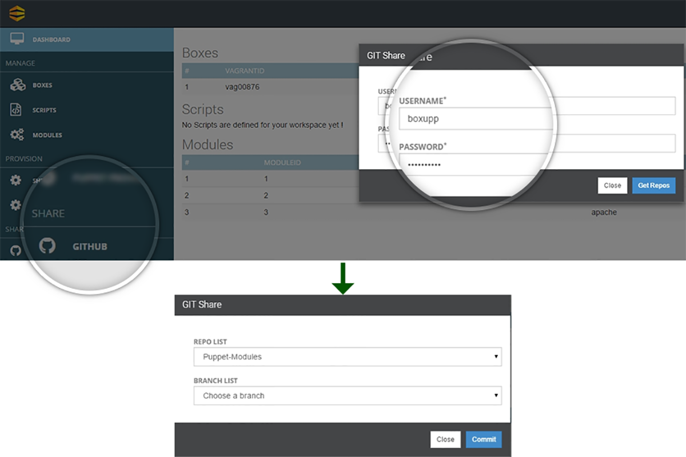

## Collaborate Using Github

Once you are done with your deployments , you can share the infrastructure transformed into code among your team members as well peer group using the most widely used collaboration platform –**Github**.

As you will click on **Github** a pop up window as shown in **(Snapshot 12)**  will appear . You just need to input your **Git’s Username and Password** and click **Get Repos** this will redirect you to a screen where all your repos and corresponding branches are listed in drop down menus.

Select  the **Repo** as well as the **Branch** and click **Commit**. This will share all your deployments on the active workspace to the selected branch.

Behind the scenes it’s the **Workspace Specific Vagrant File** which gets committed to the selected branch.

{: .img-number} 
{: .img-responsive} ``12``
  