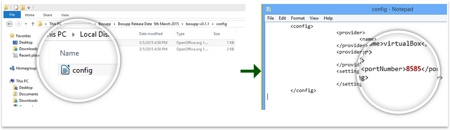

##Process of Downloading and Installing Boxupp

1. Download Boxupp by  logging onto: [http://www.boxupp.com](http://www.boxupp.com/){:target="_blank"} and clicking on download button. It will ask you to submit your email address.
2. Go to your default download folder and extract the content of downloaded .zip in any directory.
3. Windows user have to run .bat file and  MacOsx and Linux  users have to run the .sh file to install boxupp.

###Configuring Boxupp
By default Boxupp's runs on port number: 8585 but we can customize it to run on any of the available ports just browse to the directory location where you have extracted Boxupp. 

Move into the **config folder** and look for the file _**config.properties**_ open the file with any of the available text editors and  define your port number in front of port parameter as shown in the screenshot shown in the next slide. Restart the BoxUpp server if already running for the changes to take effect.

**Locate config.properties and open it in a text editor**

{: .img-responsive }

**Change the port number in the text editor and click save for the settings to take effect.**

