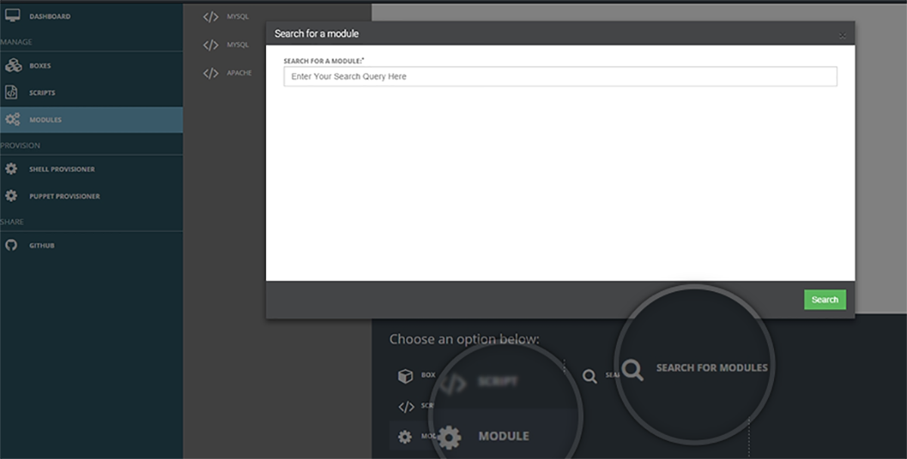
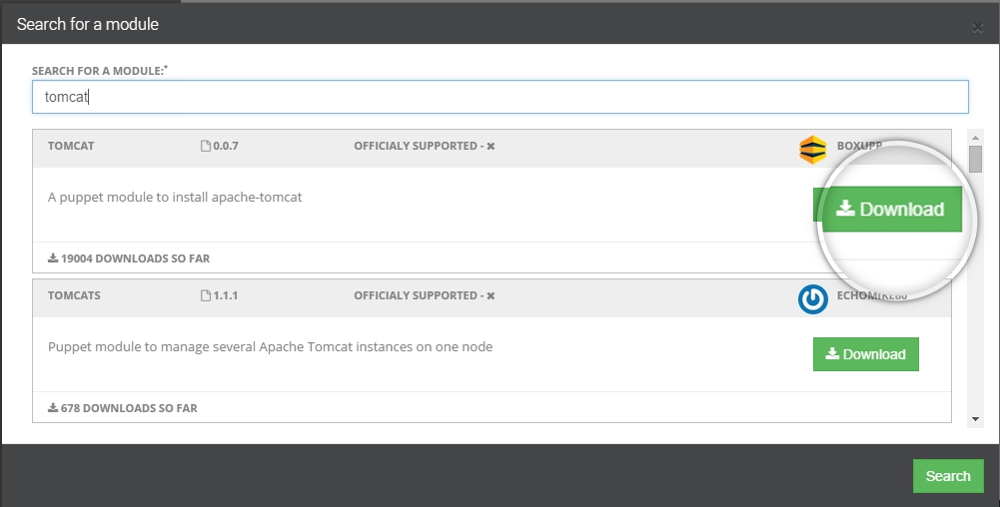

##Introduction to Modules

After we are done creating boxes, writing scripts its time to search for some  **Modules**, download them  and deploy them on various **VMS or Containers** as per our requirements.

As you will click on the Boxes tab and then click on **Search for Modules** a pop box as shown in **(Snapshot 10)** will  appear
 
 {: .img-number}
 {: .img-responsive} ``10``
 
 Users will be able to search for modules they are looking for viz. tomcat , mysql etc. As the user enters their search query and hit Search our intelligent robots will plunge  into the puppet forge database and retrieve back results which will be stacked in the order of maximum number of downloads **( Snapshot 11)**
  
 {: .img-number}
 {: .img-responsive} ``11``
 
A download button will appear for each of the listed results and clicking on download will download the module which can be deployed at any time.
