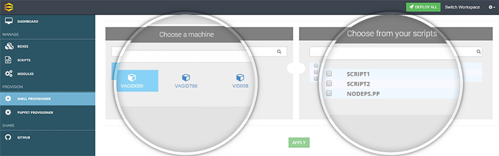
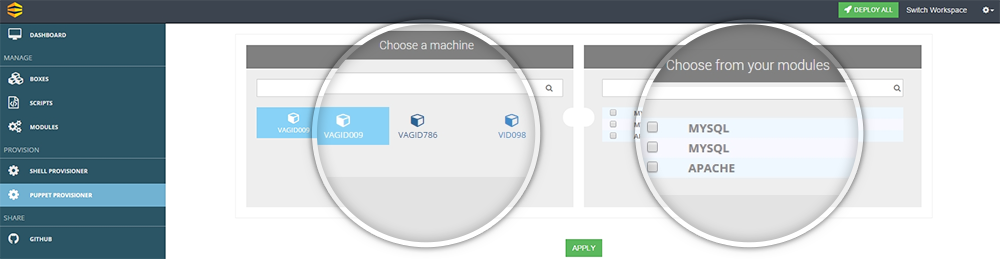

##Let’s Learn How to Provision and Deploy

Now we are all set to provision our first machines. Boxupp offers 2 provisioning processes 

**a. Shell Provisioning –** This  is primarily used to provision the scripts created by you . As you will land on to the **Shell Provisioner** tab you will see all your machines listed on the left column and all your scripts listed in the right column.

You will be able to select a machine from the left panel  and one or multiple scripts from the right panel and then click on **Apply**. Clicking on apply will queue up the selected scripts and will be ready for deployment on the selected machine.

Both columns have the search attribute so that you can quickly jump onto the machine or script you are looking for.

 {: .img-number}
 {: .img-responsive}
 
**b. Puppet Provisioning –** This  is primarily used to provision the modules downloaded by you. As you will land on to the **Puppet Provisioner** tab you will see all your machines listed on the left column and all your modules listed in the right column.

You will be able to select a machine from the left panel  and one or multiple modules from the right panel and then click on **Apply**. Clicking on apply will queue up the selected modules and will be ready for deployment on the selected machine

Clicking on **Deploy All** button located on the top right corner will start the deployment process for all the machines. In case you need to commit changes to a specific  machines you need to navigate to that machine under Boxes.

 {: .img-number}
 {: .img-responsive}
 