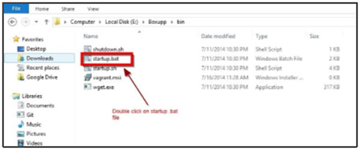
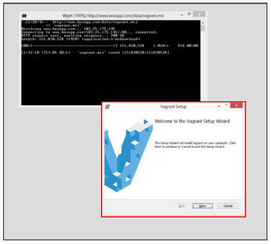
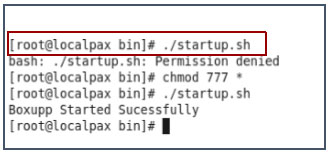

##Up and Running With Boxupp 

To run Boxupp on windows environment  browse to the folder where you have extracted Boxupp and then move to the  bin folder and run startup.bat file. It will commence with the installation. Pictorial view depicted below:

Go to bin folder double click on startup.bat ( **Windows** )
{: .img-responsive}

Installation will be shown in a command prompt window ( **Windows** )
{: .img-responsive}

**Vagrant** installation wizard will appear as a part of the boxupp’s installation process. The installation intelligence will check whether vagrant is already installed on your machine,  if it is then it will skip it.
{: .img-responsive}

After the installation of Vagrant another software package which will be installed is **Oracle VM Virtualbox**.  The pictorial view of the same is shown on this slide . 

Similar to the vagrant installation, the  installation robots will check whether Oracle VM Virtual Box is already installed on your machine,  if it is then it will skip it.

After the installation of  **Vagrant** and **Oracle VM Virtualbox** there  will be a prompt to restart your machine.Restart it and then  go to bin folder  and run **startup.bat**. 

It will show you the following 2 screen and **Boxupp** is all set to run on your local host at : [http://localhost:8585](http://localhost:8585/) . Port number may  vary if you have changed it 

{: .img-responsive}

**( Mac-OS X)**

After you have unzipped the package please execute the file “_startup.sh_”  You might get a permission denied error, to resolve this error execute a command “_chmod 777 *_”  and then again run “_startup.sh_” .  This time Boxupp will be successfully installed on your linux or mac  machine and you will be able to run that in the browser at : [http://localhost:8585](http://localhost:8585/)

{: .img-responsive}

**Now since we have successfully installed the Boxupp environment on all the platforms viz. Windows, Linux, Mac OS X. In our next sections we will take a plunge into the interactive and intuitive UI offered by the same.**

**We will also create virtualized development environment without writing a single line of code.  So Lets Get Started>**

