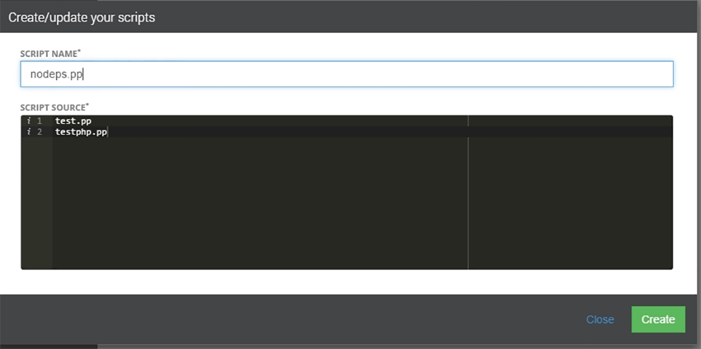
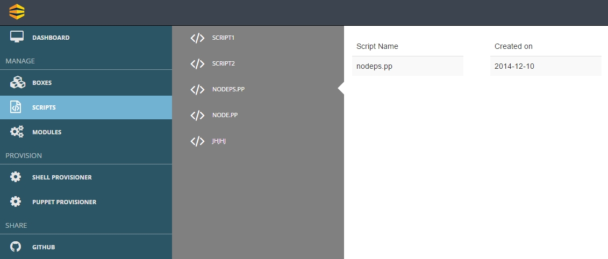

##Introduction to Script Creation

After creation of boxes its time to write some Scripts

As the user chooses the **Script** tab and clicks on **Create From Scratch** a pop up menu as shown in **(Snapshot 8)** will appear. 
 
 {: .img-number} 
 {: .img-responsive} ``8``
 
Here you need to specify the **Script Name** and the **Code Snippet** for your script.

Once you have defined your script click **Create**. The scripts will be listed  as shown in the **(Snapshot 9)**

{: .img-number}
{: .img-responsive} ``9``

