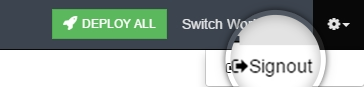
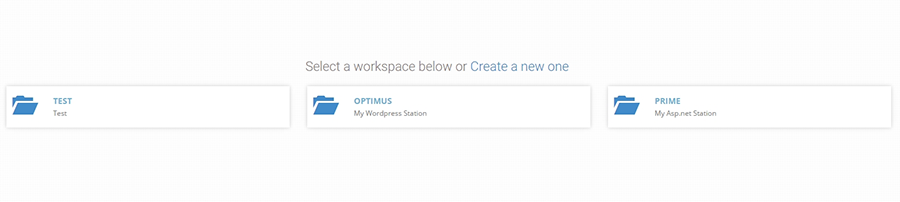

##Switch Workspace and What’s Nested Under the Gear Icon

**Switch Workspace**

Clicking on **Switch Workspace** call to action will redirect you to the **Workspace Listing** . Hence you can quickly jump from one workspace to another.

{: .img-number}
{: .img-responsive}

**Gear Icon**
As you will click on the gear icon shown on the top right corner of your screen it will give you a link to **logout** from  the Boxupp’s portal.

{: .img-number}
{: .img-responsive}

