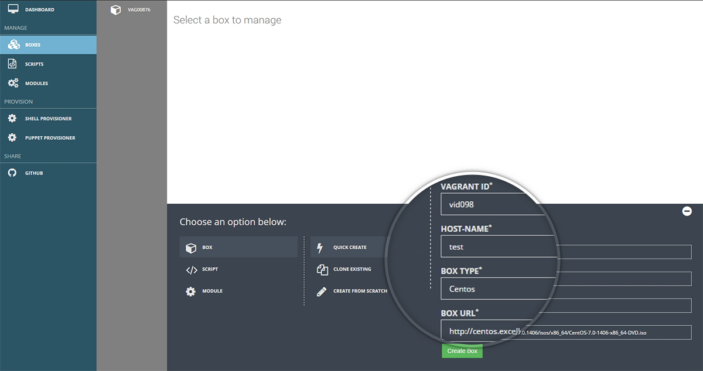
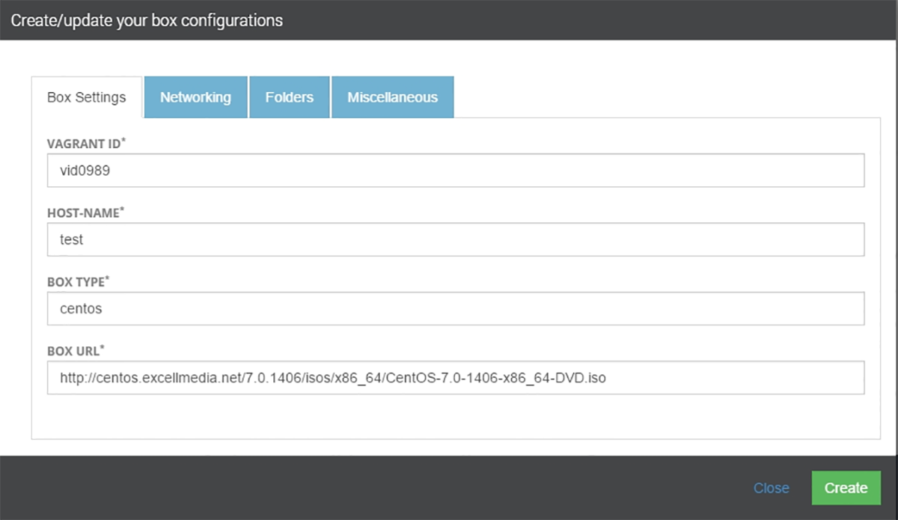
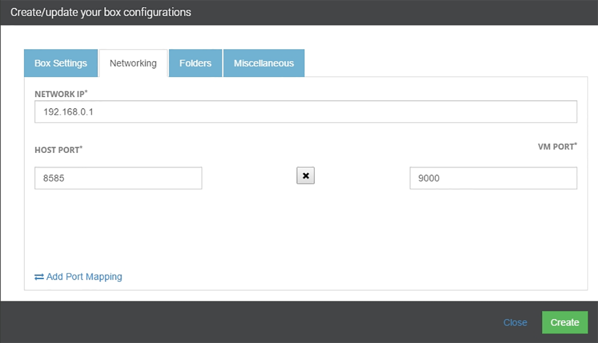
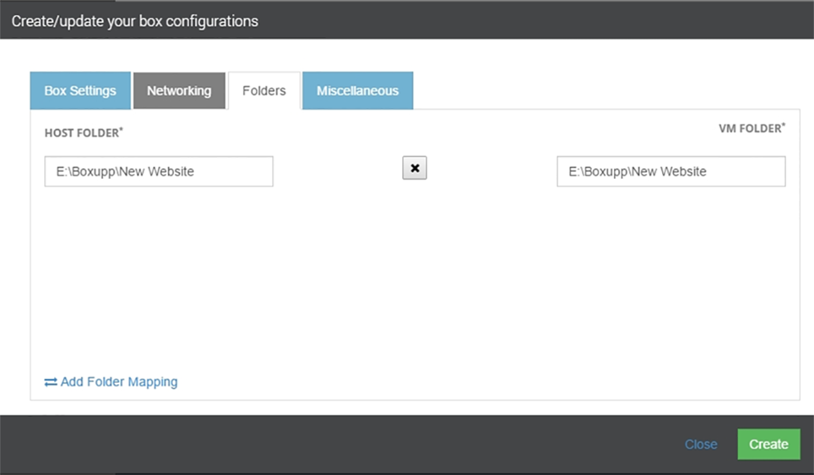
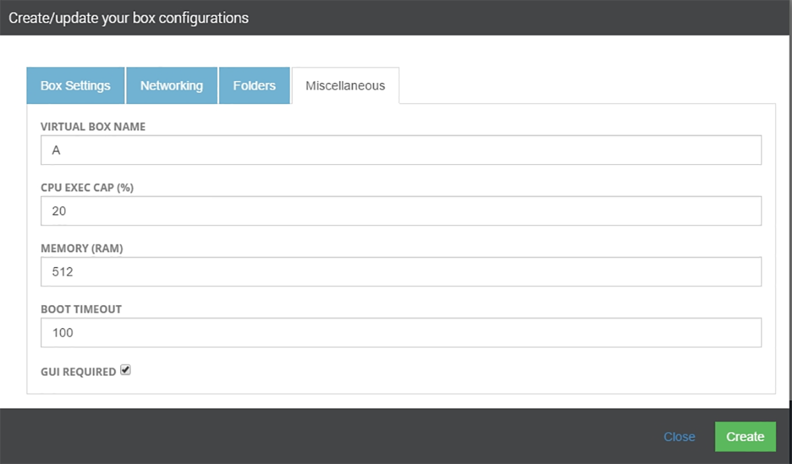

##Creation of Boxes/ Provider Chosen- Virtual Box

**Scenario 2**– You chose Virtual Box as the provider while creation of workspaces.

When virtual box is chosen aa the provider the screen for the **Quick Create** section looks slightly different

In this method you just need to specify the following attributes – a. Vagrant ID b. Hostname c. Box Type d. Box URL
and then click **Create**

{: .img-number}
{: .img-responsive}

Next  method on the list is- **Create from Scratch**

As you click on Create from Scratch a pop box will appear with 4 tabs – 

1. Box Settings 
2. Networking 
3. Folders 
4. Miscellanous

We will explore more on each of these tabs one at a time:

**Box Settings** – This screen is very similar to the one we have already stumbled across during the discussion of  **Quick Create**  method So if you need a quick revision on what to do on this screen  just jump back to the previous slide. **(Ref- Snapshot 5 (a))**

{: .img-number}
{: .img-responsive} ``5a``

**Networking** – On this tab you can select from the existent machines with which you want to setup a network and also map the **Host** and the **VM** ports **(RefSnapshot 6(a))**

{: .img-number}
{: .img-responsive} ``6a``

**Folders**- On this tab you can specify the paths of the folders which you need to bring in sync for Host and VM machines. **(Ref- Snapshot 7(a))**

{: .img-number}
{: .img-responsive} ``7a``

**Miscellaneous-** On this tab you can input the following values

1. Virtual Box Name 
2. CPU Exec Cap 
3. Memory ( RAM) 
4. Boot Timeout 
5. GUI Required **(Ref- Snapshot 7(b))**

{: .img-number}
{: .img-responsive} ``7b``

