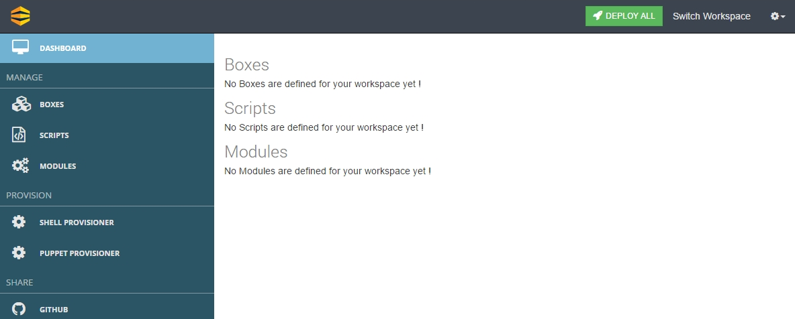
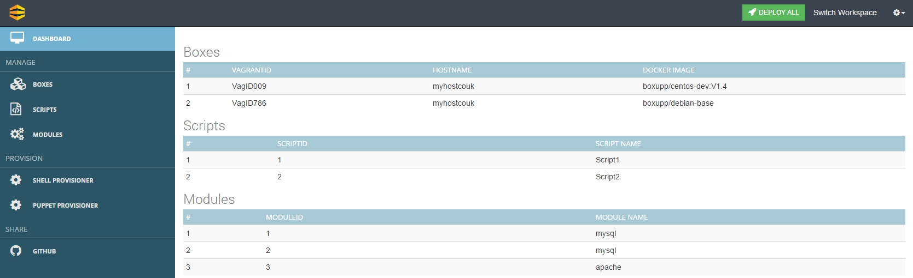

## Lets Walkthrough Dashboard

As the users will be landing onto the dashboards of specific workspaces  they will see a screen something similar to shown in **(Snapshot 3)**

{: .img-number}
{: .img-responsive} ``3``

Left Panel Comprises of Various  Main Navigation Elements Viz –

* **Boxes** 
* **Scripts**
* **Modules** 
* **Shell Provisioner**
* **Puppet Provisioner** 
* **Github**

The top Right corner shows call to actions such as **Deploy All, Switch Workspace and Sign out** . We will discuss about all these sections individually an in detail  in the upcoming screens of this presentation . Hence the dashbaord will primarily provide you with a hawk eye of various activities perfomed by the user within a workspace.

This is how the dashboard will look like once you have created some boxes, modules and scripts....

{: .img-number}
{: .img-responsive}

