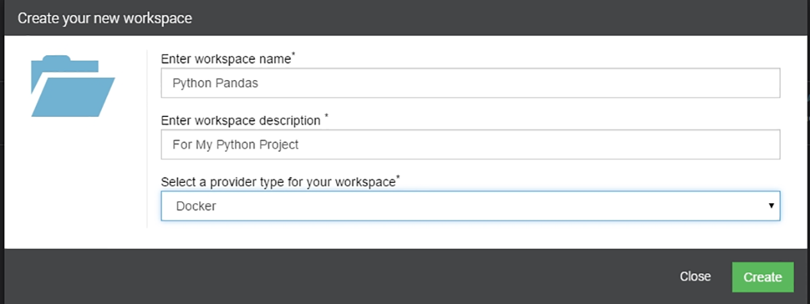
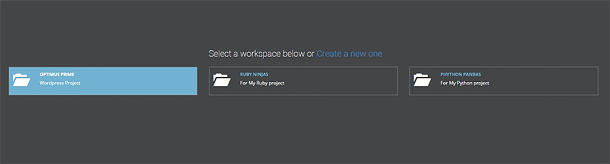

## Workspaces – First Step of The Boxupp Journey

Users will be able to create multiple workspaces according to their requirements using prominent prviders viz **(Ref- Snapshot 1)**

1. **Docker** 
2. **Virtual Box**

{: .img-number}
{: .img-responsive} ``1`` 

All the workspaces created will be listed as shown in **Snapshot2**. Clicking on any of the workspaces will redirect you to the dashboard for that workspace.

{: .img-number}
{: .img-responsive} ``2``

